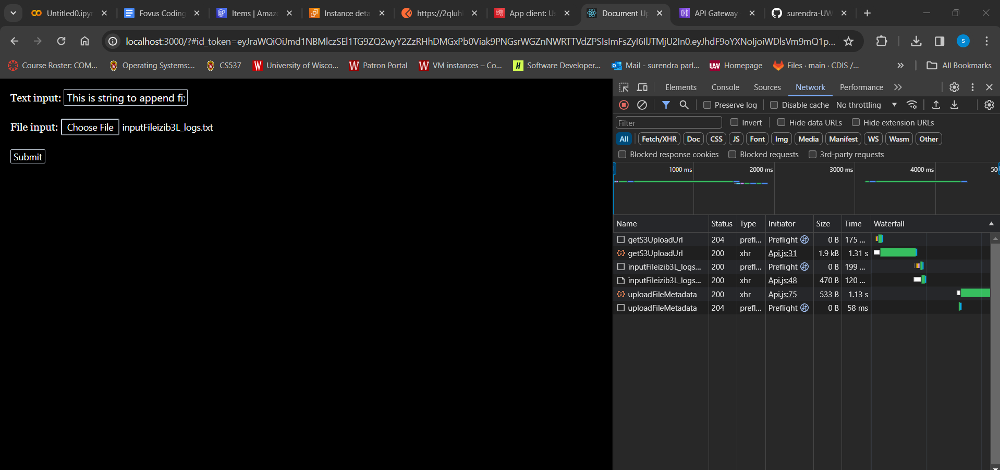
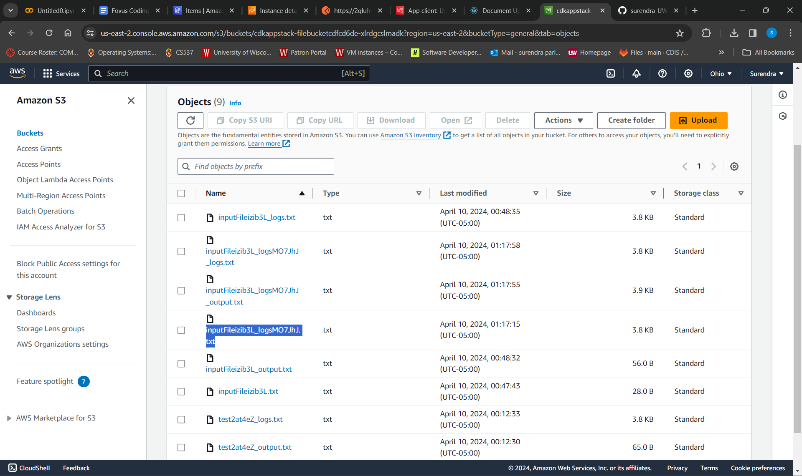
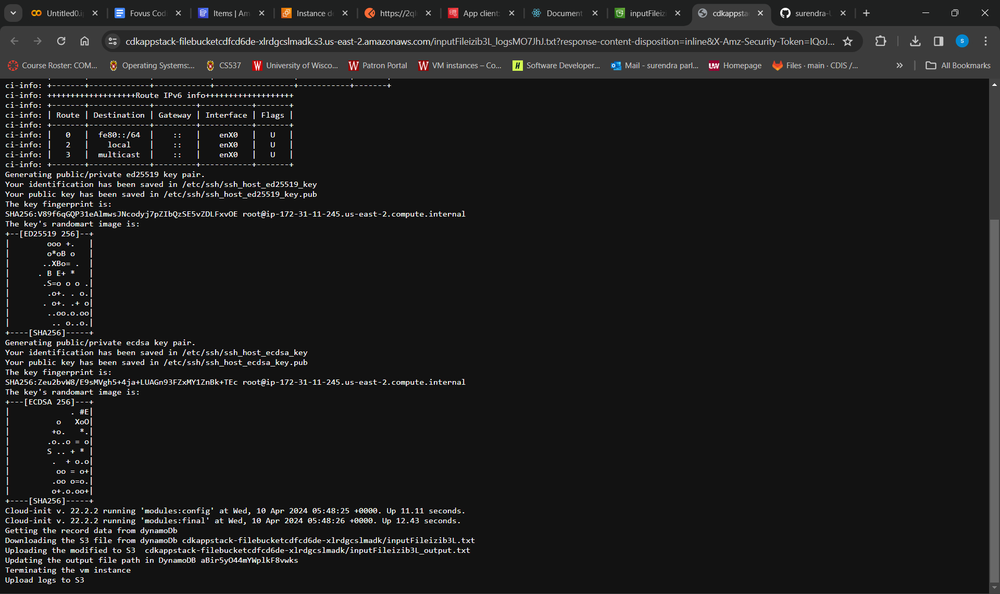
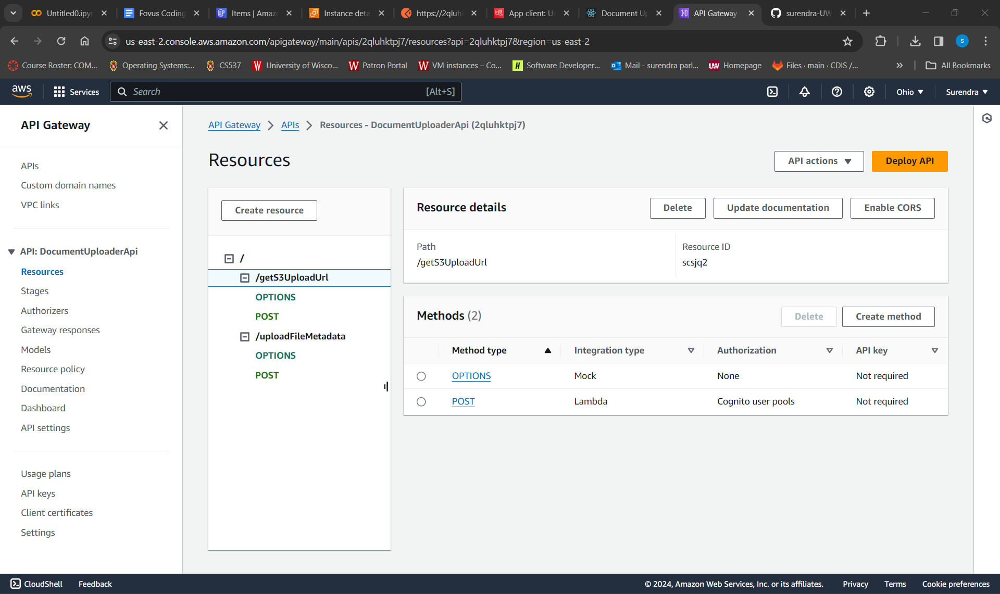
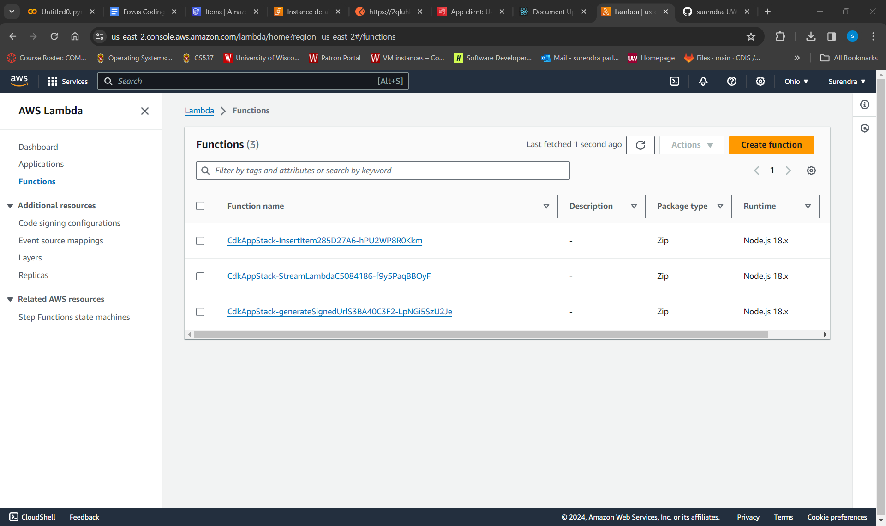
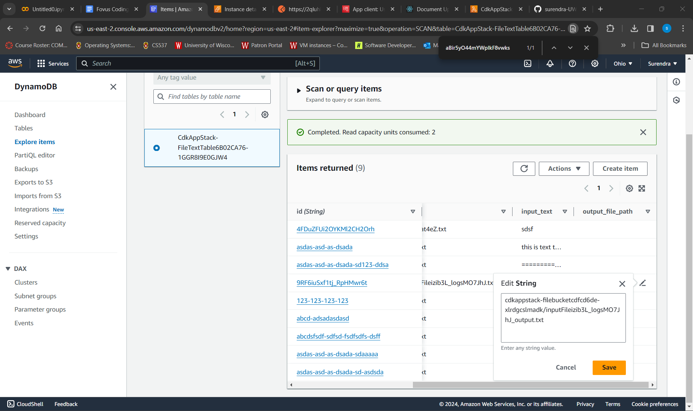
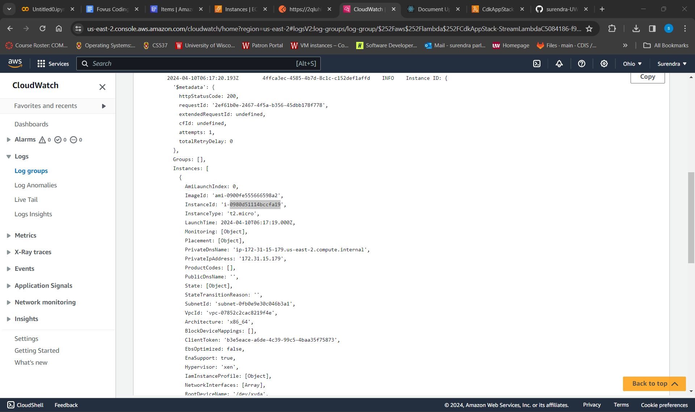
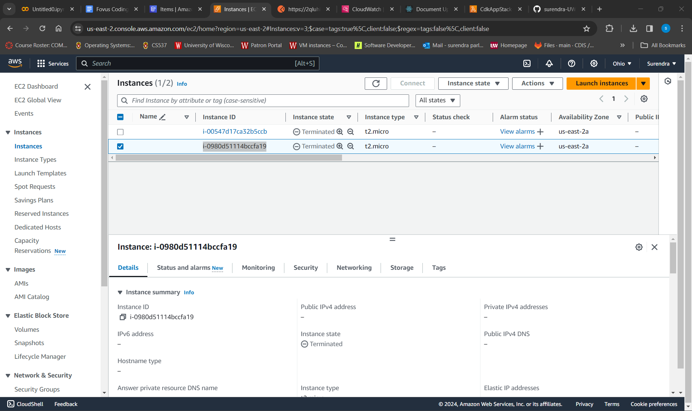
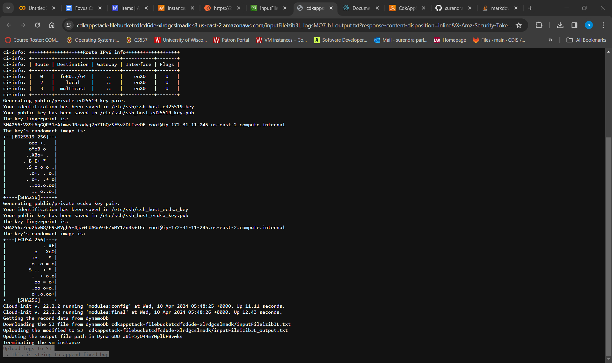

# Document File Uploader 

### Setup Instructions
Let's setup cloud infra:  
git clone <repo-url>  

#### Configure AWS cli
aws configure  
#### Deploy the infra
cd cdk-app 
npm install  
cdk deploy  

You will find the outputs  
CdkAppStack.FileUploadBucketName: (S3 bucket name) 
CdkAppStack.DocumentUploaderApiEndpoint6A2152AF (api gateway root endpoint) 
CdkAppStack.UserPoolId: (cognito user pool id) 

replace the bucket name and gateway endpoints in .env file  

#### Setup UI
cd frontend 
npm install 
npm start  

Cognito User Pool is setup in the application. First go the Cognito User UI and login/signup
You will be redirected to the App UI automatically 
A id token is generated and captured in the app.

UI is built using React and tailwind css and some components are inspired from flowbite.
File format is restricted to .txt and other formats will throw and error on UI.

On form submission the file is uploaded to S3 directly from browser using a serverless API Gateway integration through mabda using a presigned URL. Both the S3 bucket and API Gateway are enabled cors.
File can be changed with 2 configuration:
1. Same name as the input file provided by User - This config will guarantee idempodent nature i.e, user can upload as many times as he can and every time the file will be replaced without creating additional copies.
2. A unique file name is generated using "nanoid" function. This will result in new file every time user uploads the file. 
It can be configured using REACT_APP_GENERATE_UNIQUE_FILENAME env variable. If true follow 2nd case. which is default.

Now, the file metadata is uploaded to Dynamo DB through api Gateway and Lambda (InsertitemLambda)

Dynamo DB streams are configured to be processed by lambda only if it's INSERT event which will protect trigger the script multiple times when we output file path.

Ec2 Metadata which is launcehed by streamLambda logs into cloud watch logs. We can find the EC2 instance id from the logs.

EC2 is terminated as soon as the script is executed. The logs are saved into Same S3 bucket with file append with _logs and output are saved as _output suffix. 

As, we can see the output is input appended with input text.

### App hosting 
The frontend app is doesn't need a server and can easily be hosted in S3 or AWS amplify cloudFront hosting.
To host the UI install aws amplify cli  

npm install -g @aws-amplify/cli  
amplify init  
amplify add hosting  
amplify push  